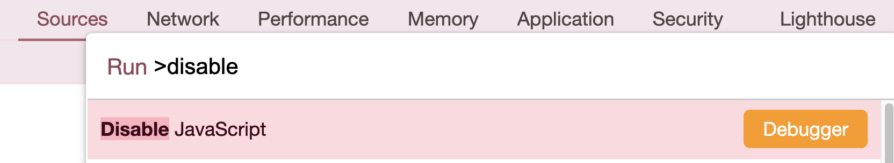
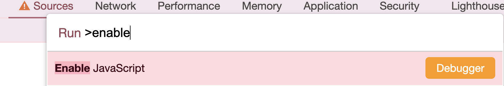

# LEARN_NEXTJS14

next.js14 공부하기

## Day1 - Defining Rout

Next.js는 폴더를 사용해 경로를 정의하는 파일 시스템 기반 라우터를 사용한다.
각 폴더는 URL 세그먼트에 매핑되는 경로 세그먼트를 나타낸다.
중첩된 경로를 만들려면 폴더를 서로 중첩하면 된다.
ex. app/dashboard/setting/page.tsx

page.tsx가 없는 폴더는 렌더링되지 않는다.
app 폴더 내에 폴더, 파일을 만들어도 된다? -> O, page라는 파일을 만들지 않는 이상 실제 경로에 포함되지도 렌더링 되지도 않음

## Day2 - Not Found Routes

찾을 수 없는 파일은 경로 내 세그먼트 내에서 notFound 함수가 실행될 때 UI를 렌더링하는데 사용됨.
사용자 정의 UI 제공과 함께 Next.js는 스트리밍된 응답의 경우 200 HTTP 상태 코드를 반환하고 스트리밍되지 않은 응답의 경우 404를 반환.

`usePathname`
usePathname은 현재 URL의 pathname을 읽을 수 있게 해주는 클라이언트 컴포넌트 훅.
클라이언트 컴포넌트 훅을 사용할 땐 `'use client'`를 코드 최상단에 작성해줘야 됨.

## Day3 - SSR vs CSR

rendering 이란?
next.js가 우리의 react component를 가져와서 브라우저가 이해할 수 있는 html로 변환하는 작업이다.

### CSR(Client Side Rendering)

react의 렌더링 방식이며, 브라우저가 rendering 작업을 한다.
즉, CSR은 브라우저의 JavaScript 엔진에 의해 rendering이 수행된다.
사용자 브라우저인 client 단에서 모든 rendering 작업을 수행해야 한다.(client가 사용자 브라우저에 UI를 구축해야한다는 의미)
client는 JavaScript를 로드하고, 그 후에 JavaScript가 UI를 빌드한다.

CSR(Client Side Rendering)의 단점 1. 초기 로딩 속도가 느리다.(사용자는 자바스크립트 파일을 다운로드하고, 동적으로 DOM을 생성하는 시간을 기다려야 하기 때문)

    예를 들어, React-application에서 페이지의 소스코드를 보면 페이지의 실제 소스코드는 비어있다.
    `<div id="root"></div>` 여기에는 UI가 없다.
    페이지 검사를 눌러서 보이는 태그들은 Javascript에 의해 페이지에 추가된 것이다.
    브라우저가 JavaScript 파일을 다운로드하고 실행한 후에 보여진다.

    CSR의 경우 새로고침하면 페이지에 아무것도 없는 순간을 볼 수 있는데,
    이 순간은 React를 실행시키고 UI를 화면에 올리기 위해 `브라우저가 모든 JavaScript 파일을 다운로드하고 실행시키는데에 걸리는 시간이다.`
    만약 사용자가 데이터 연결 상태가 안좋은 환경에서 웹사이트에 접속한다고 가정해보자. 사용자는 모든 JavaScript 파일을 다운받아야 하고, 모든 파일이 다운로드 완료될 때까지 기다려야 한다. 따라서 빈 화면(페이지에 아무것도 없는 순간)을 훨씬 오래봐야하는 상황이 발생할 수 있다.

    2. SEO 검색 엔진 최적화

    `Google은 페이지의 HTML을 본다.` 따라서 만약 직접 만든 웹사이트가 Google에 노출되길 바란다면, 빈 페이지를 보여주지 않는 것이 좋다.
    가끔 Google이 페이지의 JavaScript를 실행시키기도 하지만, 위험을 감수하는 것 보다는 HTML에 웹사이트의 유용한 실제 데이터가 들어있는 편이 나을 것이다. 그리고 다른 검색 엔진들은 페이지에서 JavaScript를 실행하지 않을 수도 있다.
    CSR을 사용하면 검색 엔진은 비어있는 웹사이트를 보는것이다. 따라서 SEO의 문제를 겪는 것이다.

### SSR(Server Side Rendering)

우리가 next.js로 웹사이트를 빌드할 때는 자동적으로 Server Side Rendering이 된다.
페이지의 소스코드를 보면 페이지 내용들이 모두 브라우저 코드에 있는 걸 확인할 수 있다. 이미 화면에 표시할 HTML을 갖고 있기 때문이다.
이는 브라우저가 JavaScript가 로드될 때까지 기다릴 필요가 없다는 것을 뜻한다.

next.js application은 page 안의 모든것, component 안의 모든것들을 nextJs가 우선적으로 Server에서 render한다.
next.js는 모든 컴포넌트를 서버에서 render 해서 그 html을 가지고 있고, 이 html을 브라우저 request에 대한 response로 준다.
최초 application의 UI 빌드에서는 JavaScript에 의존하지 않는다. UI는 이미 빌드되어 있고, HTML도 이미 존재하고 있다.
(사용자가 처음 페이지에 도착했을 때, UI를 빌드하는데에 JavaScript는 필요하지 않다.)

`❗️NextJs에서는 "use client"가 사용여부와 관계없이, 모든 컴포넌트와 페이지들은 먼저 backend(서버)에서 render 된다. 이것들은 HTML로 변환된다. 그리고 변환된 HTML은 브라우저로 넘어간다.❗️`

## Day4 - Hydration

Day3에서 NextJs는 페이지와 컴포넌트들을 기본적으로 Backend에서 Render한다는 것과 NextJs는 코드를 HTML로 변환하고 HTML을 브라우저에 넘긴다는 것을 배웠다.
그 다음에는 어떤 일이 일어날까? 사용자가 최초 HTML을 본 뒤에 어떤 일이 발생하는지, React가 언제 활성화되는지 알아보자.

```jsx
// components/navigation.tsx

'use client';

import Link from 'next/link';
import { usePathname } from 'next/navigation';

export default function Navigation() {
    const path = usePathname();
    // console.log(path);
    return (
        <nav>
            <ul>
                <li>
                    <Link href="/">Home</Link> {path === '/' ? '🩷' : ''}
                </li>
                <li>
                    <Link href="/about-us">About Us</Link> {path === '/about-us' ? '🩷' : ''}
                </li>
            </ul>
        </nav>
    );
}
```




크롬 개발자도구 > Source > JavaScript를 비활성화 하고 네비게이션을 클릭하여 페이지가 이동될 때 보이는 것 처럼 hard navigation(새로고침)이 일어난다.

-   Soft Navigation: 어플리케이션이 활성화 된 상태에서 Link, Router 등을 통해 페이지를 Navigate 하는 경우
-   Hard Navigation: 전체 페이지가 새로고침 되는 경우. (ex. URL을 통한 접속, 새로고침 등) default.tsx를 먼저 렌더 시도하고, 불가능하면 404를 렌더한다.




다시 JavaScript를 활성화한 후 확인해보면 새로고침이 되지 않고 soft navigation이 일어난다.
이것이 바로 React가 `Hydrated` 되었다고 한다.

처음에는 anchors 묶음이였다가 React component로 변환되는 것이다.
네비게이션에 click이 발생되면 React가 끼어들어 전체 페이지 전체를 reload 하지 않고 빠르게 navigate 할 수 있게 된다.
click이 발생하면 anchor가 아닌 Link component로 처리되는 것이다.

페이지에 도달하면 UI를 가지고 있는 dummy HTML이 있고, 그리고 나서 프레임워크는 즉시 로드를 시작한다.
React가 로드되고, Components가 로드되고, 모든것이 초기화 된다. 그러면 application은 React App이 된다.
이 과정 후에 비로소 interactive해지고, navigation이 빨라지는 것을 볼 수 있으며, hard refresh없이 Client Side Navigation이 가능하다.

예를 들어 설명해보자

1. 사람들이 /about-us 페이지로 가고 싶어한다.
2. nextJs는 그 요청을 보고 우리의 component를 interactive 하지 않은 dummy HTML로 변환하여 렌더링한다.
3. 서버 사이드 렌더링이므로 초기 로딩속도가 빨라 사람들은 기뻐한다 :)
4. 그리고 사용자가 기뻐하는 동안 뒤에서 프레임워크는 Load를 시작해 dummy HTML에다가 새로운 React application을 초기화하고 있다.
5. React application이 초기화 된 후 Client Side Navigation이 가능하다.

<다이어그램으로 보기>

`/about-us ----> Boring HTML ----> people :) ----> init(Boring HTML)  ---> soft navigaion!!`

만약 어떠한 이유로 JavaScript Load에 긴 시간이 걸리고, Framework가 initailize하는데이 아주 긴 시간이 걸린다고 가정해보자.
사용자는 네비게이션을 통해 페이지 사이를 navigate할 수 있지만, 아직 React Component가 아니기 때문에 hard navigation이 일어나고 이동될 때마다 새로고침이 발생될 것이다. 그러다 JavaScript가 로드되어 모든 준비가 완료된 순간 React Component가 되어 interactive한 soft navigation이 가능해지는 것이다.

```jsx
// components/navigation.tsx
// 클릭하면 카운트가 증가하는 버튼을 추가했다.
'use client';

import Link from 'next/link';
import { usePathname } from 'next/navigation';
import { useState } from 'react';

export default function Navigation() {
    const path = usePathname();
    const [count, setCount] = useState(0);
    // console.log(path);
    return (
        <nav>
            <ul>
                <li>
                    <Link href="/">Home</Link> {path === '/' ? '🩷' : ''}
                </li>
                <li>
                    <Link href="/about-us">About Us</Link> {path === '/about-us' ? '🩷' : ''}
                </li>
                <li>
                    <button onClick={() => setCount((c) => c + 1)}>{count}</button>
                </li>
            </ul>
        </nav>
    );
}
```

JavaScript를 비활성화 하고 버튼을 클릭하면 click은 되지만 카운트가 증가되지 않는다. 왜냐하면 버튼에 eventListener가 연결되지 않았기 때문이다.
그러나 JavaScript를 다시 활성화되었다면(JavaScript가 로드되었다면) React가 버튼에 eventListener를 연결시켜 비로소 컴포넌트가 interactive해진다.

다시 예를 들어 설명해보자

1. /about-us에 접속
2. 0이 쓰여진 버튼이 사용자에게 보여짐(JavaScript 로드 전)
3. 사용자는 기뻐함 :) 동시에, 뒤쪽에서 프레임워크를 로드하고 프레임워크가 initialize 됨(JavaScript 로드 완료)
4. 비로소 버튼은 우리가 만든 onClick eventListener가 연결된 버튼이 됨

<다이어그램으로 보기>

`/about-us ----> <button>0</button> ----> people :) ----> <button onClick>`

이 과정이 Hydration 이다!

### 즉, Hydration이란?

-   단순 HTML을 React application으로 초기화하는 작업
-   Next.js는 초기 Html 파일을 먼저 전달하고 이후 HTML 요소들을 React 컴포넌트로 변환 및 이벤트리스너를 부착하여 React DOM에서 관리하게 한다. 이 과정을 Hydration(수분 보충)이라고 한다.
-   서버사이드 렌더링(SSR)을 통해 만들어 진 인터랙티브 하지 않는 HTML을 클라이언트 측 자바스크립트를 사용하여 인터랙티브한 리액트 컴포넌트로 변환하는 과정을 말한다.(서버 환경에서 이미 렌더링된 HTML에 React를 붙이는 것)

## Day5 - use client

모든 컴포넌트는 backend에서 render되고, "use client"를 작성한 컴포넌트에서만 hydrate되어 interactive해진다.
우리는 어떤 컴포넌트에 "use client"를 작성할지 고민하지 않아도 된다.
만약 useState를 사용하고 있는 컴포넌트에 "use client"를 작성하지 않았다면, NextJs에서 에러를 던져준다.(useState를 사용한다는건 interactive한 컴포넌트이기 때문에)

기본적으로 "use client"를 작성하지 않은 컴포넌트는 서버 사이드 렌더링이 된다. 서버 사이드 컴포넌트는 자바스크립트 코드를 로드할 필요가 없어 페이지 로딩 속도가 빨라진다는 장점이 있다.

## Day6 - Layouts

Layout을 사용하는 이유는 애플리케이션에서 재사용하는 요소를 줄이기 위해서이다.
예를들어 네비게이션바 컴포넌트가 모든 페이지에서 사용된다면 모든 페이지에 네이게이션바 컴포넌트를 import 해야한다. 만약 100페이지라면 100번 복붙을 해야한다.. 이렇게 반복을 없애기 위해 사용할 수 있는게 Layout 시스템이다.

### Layout 동작 방식

NextJs는 layout 컴포넌트에 있는 export된 컴포넌트를 제일 먼저 렌더링한다.
그 후에 URL을 확인한 후 URL에 해당하는 컴포넌트를 렌더링한다.

```
<Layout>
 <AboutUs />  <== childred prop
</Layout>
```

### 특정 페이지에서 layout 만드는 방법

특정 페이지에서 다른 layout을 사용하고 싶다면, url폴더 아래 layout 컴포넌트를 생성해서 다른 레이아웃을 만들 수 있다.

1. app/about-us/layout.tsx <- 특정 페이지에 레이아웃 생성하기
2. app/about-us/company/jobs/sales/layout.tsx <- 특정 페이지에 레이아웃 생성하기
3. app/layout.tsx

```
<rootLayout>
    <AboutUsLayout>
        <SalesLayout>
            <Sales>
        </SalesLayout>
    </AboutUsLayout>
</rootLayout>
```

`1,2에 레이아웃은 상쇄되는게 아니라 중첩된다.`
Nest JS는 URL를 통해 폴더로 들어가서 그 폴더에 레이아웃이 있는지 확인하고, 있다면 그 레이아웃을 밖에 있는 다른 레이아웃 안에 렌더링한다.

## Day7 - Meta Data

-   메타데이터는 컴포넌트가 아닌, 페이지나 레이아웃 내에서만 사용할 수 있고, 서버 컴포넌트에서만 메타데이터를 사용할 수 있다.
-   레이아웃처럼 메타데이터도 템플릿을 만들 수 있다.

```
import { Metadata } from "next"
import Navigation from "../components/navigation"

export const metadata: Metadata = {
    title: {
        template: "%s | Next Moviese",
        default: 'Loading'
    },
  description: 'The bedt movies on thie best framework',
}
```

## Day8 - Dynamic Routes

-   영화 목록 페이지에서 영화 하나를 클릭헤 영화 디테일 페이지로 이동할 때 movies/1 이런식으로 url을 사용한다.
-   리액트는 movies/:id 다이나믹 라우트를 사용할 때 hook을 사용했으나, Next에서는 훅이 필요없다.
-   다이나믹 라우트 만드는 방법은 대괄호를 사용한다.
-   movies/[id]/page.tsx

    -   아래와 같은 url은 모두 위에 작성한 라우트에 매칭된다.
    -   movies/1234
    -   moviese/www

-   props로 params, searchParams를 받을 수 있고, 백엔드에서 실행되기 때문에 브라우저가 아닌 백엔드 콘솔에서 id, searchParams를 확인할 수 있다.

```
export default function MovieDetail(props) {
    console.log(props)
    return <h1>Movie</h1>
}
```

`{ params: { id: '11' }, searchParams: { page: "'ke'" } }`

## Day9 - Data Fetching_Client Side

-   클라이언트 사이드에서 데이터 페칭 방법
    -   useState, useEffect 훅을 사용해 데이터를 관리해야한다.
    -   isLoading과 같은 로딩상태도 직접 관리해야 한다.
    -   React App <==> API <===> DB
    -   직접 서버와 통신하는것이 아닌 API를 통해서만 통신한다.

```jsx
'use client';

import { useEffect, useState } from 'react';

// 클라이언트 사이드 렌더링에선 메타데이터를 사용할 수 없다.
// export const metadata = {
//     title: 'Home',
// };

export default function Page() {
    const [isLoading, setIsLoading] = useState(true);
    const [movies, setMovies] = useState([]);
    const getMovies = async () => {
        const response = await fetch('https://nomad-movies.nomadcoders.workers.dev/movies');
        const json = await response.json();
        setMovies(json);
        setIsLoading(false);
    };
    useEffect(() => {
        getMovies();
    }, []);
    return <div>{isLoading ? 'Loading...' : JSON.stringify(movies)}</div>;
}
```
